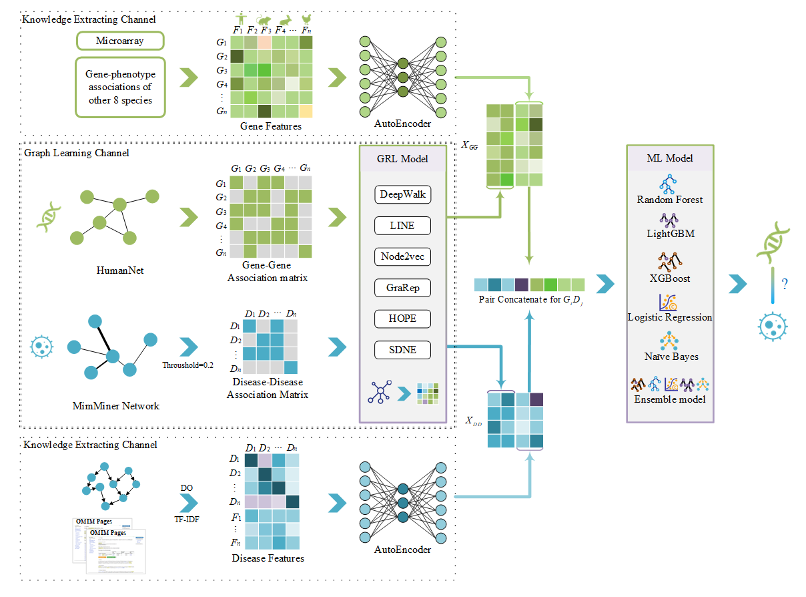

# About MGREL

This repository store the code for paper **MGREL: A multi-graph representation learning-based ensemble learning method for gene-disease association prediction**.

We first re-organized the current gene-disease association prediction benchmark by extracting the latest gene-disease associations from the OMIM database. Then, we developed a multi-graph representation learning-based ensemble model, named MGREL to predict potential gene-disease associations. MGREL integrated two channels to extract gene and disease features, including knowledge extraction channel and graph learning channel. Then ensemble machine learning methods were used as the classifier to predict the association. The workflow of MGREL model was shown in Figure.

# Data

We adopted and reorganized a gene-disease association benchmark dataset as widely used in the previous studies **[RGCN](https://github.com/liyu95/Disease_gene_prioritization_GCN/tree/af763c0ea291406da89edbe92525edb79a03c69a/data_prioritization) AND [LUPI](https://github.com/juanshu30/Disease-Gene-Prioritization-with-Privileged-Information-and-Heteroscedastic-Dropout)**, which consists of gene-disease associations, gene-gene associations, disease-disease associations, gene features, and disease features (as shown in **Table**). See more details in the paper.

| Data              | Source                     | Num   | Edges  | Dimensions |
| ----------------- | -------------------------- | ----- | ------ | ---------- |
| Association       |                            |       |        |            |
| Gene-disease      | CTD                        |       | 22054  | -          |
| Gene-Gene         | HumanNet                   | 12331 | 733836 | -          |
| Disease-Disease   | MinMiner                   | 3215  | 645945 | -          |
| Features          |                            |       |        |            |
| Gene  features    | Microarray                 | -     | -      | 4536       |
| Gene  features    | gene-phenotype association | -     | -      | 12944      |
| Disease  features | DO similarity              | -     | -      | 16592      |
| Disease  features | TF-IDF of OMIM text        | -     | -      | 16592      |

*The sum dimensions of DO similarity, TF-IDF of OMIM text is 16592*

# Reference

If you are interested in this work, please see details in this article and cite it. Thanks!

[MGREL: A multi-graph representation learning-based ensemble learning method for gene-disease association prediction](https://doi.org/10.1016/j.compbiomed.2023.106642)

# Acknowledgement

This project could not be developed without the support of **collaborators [gu-yaowen](https://github.com/gu-yaowen)**.
We also thank the open source OMIM database, the NCBI database and the [OpenNE](https://github.com/thunlp/OpenNE) library.